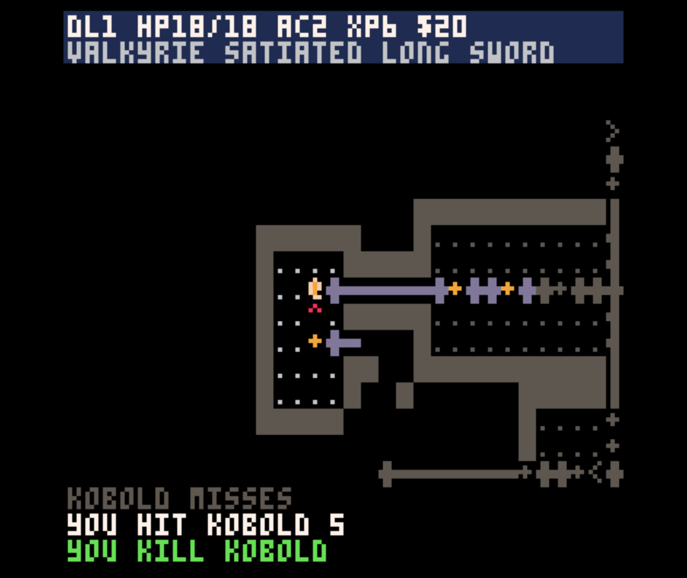

# NetAcht

NetAcht is an unofficial NetHack-inspired demake for PICO-8. It compresses a roguelike dungeon crawl into a tiny cartridge: procedural room-and-corridor levels, turn-based movement, monsters, traps, hunger, inventory, weapons, armour, potions, scrolls, wands, prayer, gold, levelling, and a Yendor-style objective.

## Play

The cartridge is available as:

- `src/netacht.p8.png` - PICO-8 cartridge image, suitable for SPLORE/BBS upload
- `src/netacht.p8` - readable PICO-8 source cart

Open either file with PICO-8, or upload `src/netacht.p8.png` to a PICO-8 BBS post.

## Controls

- Arrow keys: move, attack, select menu options
- `X`: wait / confirm / open inventory depending on context
- `O`: use selected inventory item
- Left/right in inventory: drop selected item

## Notes

NetAcht is a small original reimplementation/demake inspired by NetHack. It is not affiliated with or endorsed by the NetHack project.

## License

MIT. See `LICENSE`.
